# Projeto-asg-aws-cloudwatch
Repositório do projeto de Auto Scaling, CLB e  Endpoint de Teste.
# Projeto de Auto Scaling na AWS com Classic Load Balancer (CLB)

## Visão Geral do Projeto

Este projeto demonstra a implementação de um sistema de Auto Scaling na Amazon Web Services (AWS) utilizando um Classic Load Balancer (CLB), um Auto Scaling Group (ASG) e políticas de escalabilidade baseadas em métricas do Amazon CloudWatch. O objetivo é garantir que a aplicação web mantenha a alta disponibilidade e a elasticidade, ajustando automaticamente o número de instâncias EC2 em resposta à demanda de tráfego.

## Componentes da Arquitetura

A arquitetura implementada consiste nos seguintes serviços AWS:

1.  **Amazon EC2:** Máquinas virtuais que hospedam a aplicação web ("hello world").
2.  **Classic Load Balancer (CLB):** Distribui o tráfego de entrada para as instâncias EC2 saudáveis.
3.  **Auto Scaling Group (ASG):** Gerencia a coleção de instâncias EC2, garantindo que o número desejado de instâncias esteja sempre em execução.
4.  **Amazon CloudWatch:** Monitora métricas de performance (como RequestCount do CLB) e dispara alarmes.
5.  **Políticas de Escala Dinâmica (Dynamic Scaling Policies):** Definem as ações do ASG em resposta aos alarmes do CloudWatch.

## Configuração e Implementação

### 0. Criação de Chave de Par (Key Pair) para SSH

Para se conectar às suas instâncias EC2 via SSH

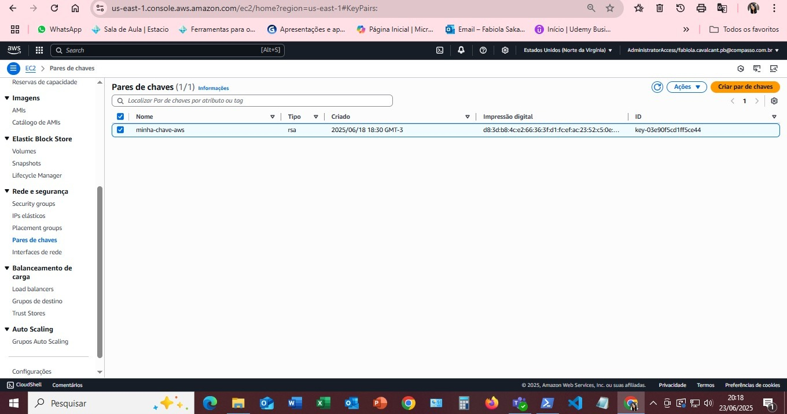

### 0.1 Criação da VPC e Subredes

Criação de uma VPC (Virtual Private Cloud) e algumas sub-redes públicas, eliminando a necessidade de NAT Gateway.

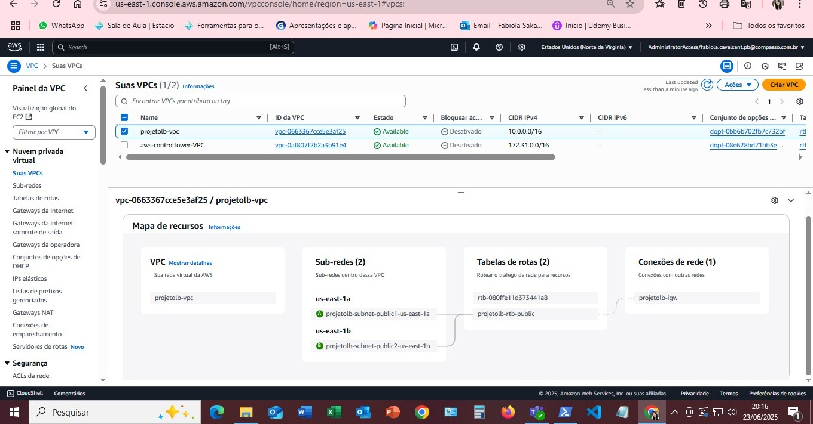

### 1. Aplicação Web Simples (Hello World)

As instâncias EC2 foram configuradas para servir uma página web simples com a mensagem "hello world". Isso foi verificado acessando o DNS do Load Balancer.

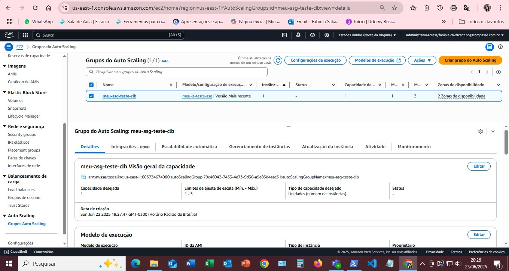

### 2. Classic Load Balancer (CLB)

Um CLB foi criado para distribuir o tráfego. Ele foi associado às sub-redes públicas e configurado para direcionar o tráfego para as instâncias do Auto Scaling Group.

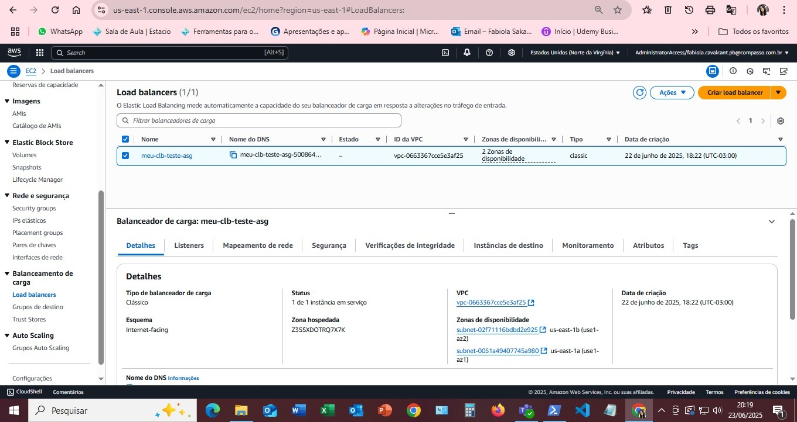
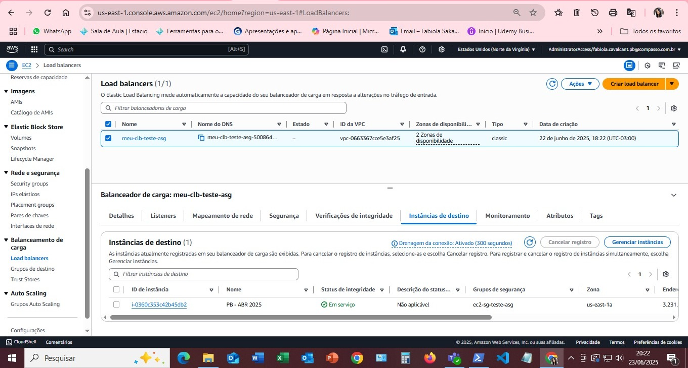
### 3. Auto Scaling Group (ASG)

O ASG (`meu-asg-teste-clb`) foi configurado para gerenciar as instâncias EC2. Ele utiliza um Modelo de Lançamento para definir as características das instâncias (AMI) e está associado a múltiplas zonas de disponibilidade para alta resiliência.

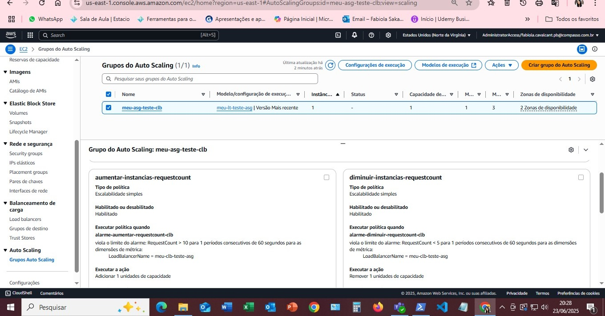
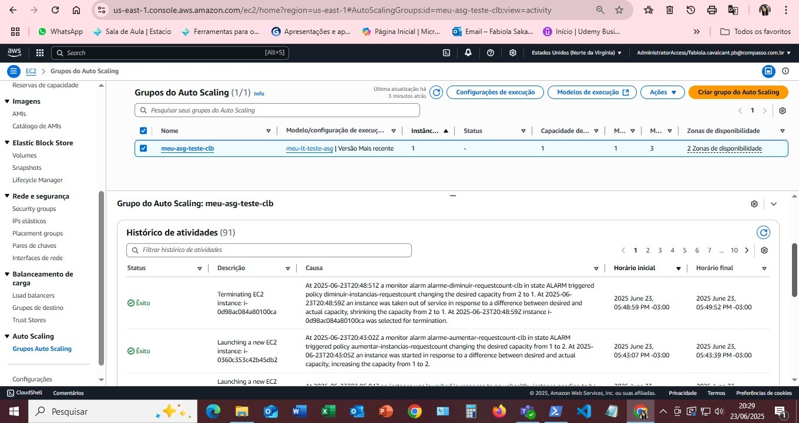

### 4. Alarmes do CloudWatch

Dois alarmes principais foram configurados no CloudWatch para monitorar a métrica `RequestCount` do CLB:

* **`alarme-diminuir-requestcount-clb` (Scale In):** Dispara quando o número de requisições cai abaixo de um limiar.
    * **Condição:** `RequestCount < 5` (para 1 ponto de dados em 1 minuto)
    * **Métrica:** `AWS/ELB RequestCount`, Estatística `Average` (Média).

    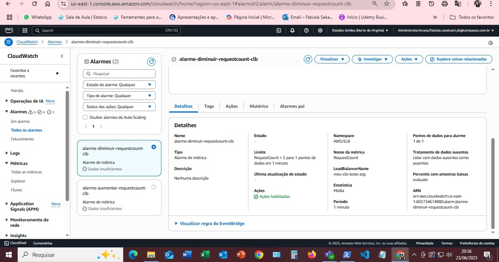
    
    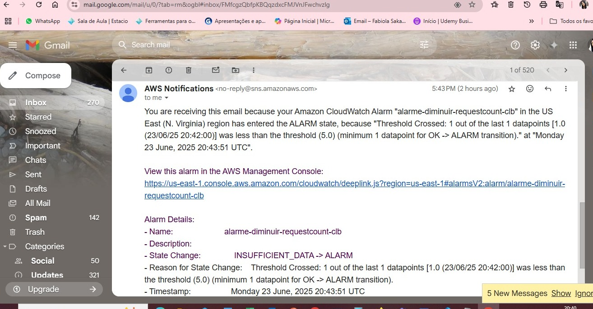

* **`alarme-aumentar-requestcount-clb` (Scale Out):** Dispara quando o número total de requisições excede um limiar.
    * **Condição:** `RequestCount > 100` (para 1 ponto de dados em 1 minuto)
    * **Métrica:** `AWS/ELB RequestCount`, Estatística `Sum` (Soma). (Importante: a estatística foi ajustada de Média para Soma para capturar o volume total de tráfego do LB).

    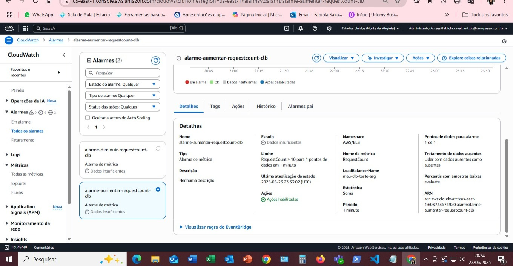
    
    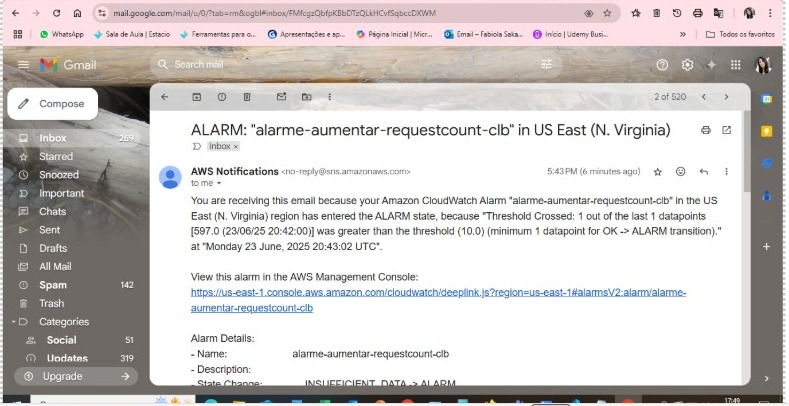
    
        

### 5. Políticas de Escala Dinâmica

Duas políticas de escalabilidade foram associadas ao ASG:

* **`diminuir-instancias-requestcount`:** Vinculada ao `alarme-diminuir-requestcount-clb`. Quando acionada, remove 1 unidade de capacidade.

    

* **`aumentar-instancias-requestcount`:** Vinculada ao `alarme-aumentar-requestcount-clb`. Quando acionada, adiciona 1 unidade de capacidade.

    

## Teste e Validação

Para validar o funcionamento do Auto Scaling, foram realizados testes de carga utilizando a ferramenta `hey` e o monitoramento em tempo real dos alarmes do CloudWatch e do histórico de atividades do Auto Scaling Group.

### Teste de Diminuição de Capacidade (Scale In)

Quando o tráfego foi baixo ou inexistente, o alarme `alarme-diminuir-requestcount-clb` entrou no estado `ALARM`, indicando que a capacidade poderia ser reduzida.

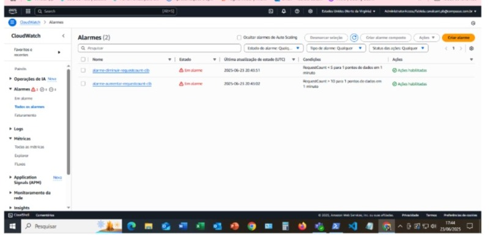

### Teste de Aumento de Capacidade (Scale Out)

Para simular o aumento de tráfego, o comando `hey` foi utilizado para gerar um volume significativo de requisições por um período sustentado (por exemplo, `hey -z 3m -c 50 http://seu-dns-do-clb.amazonaws.com/`).
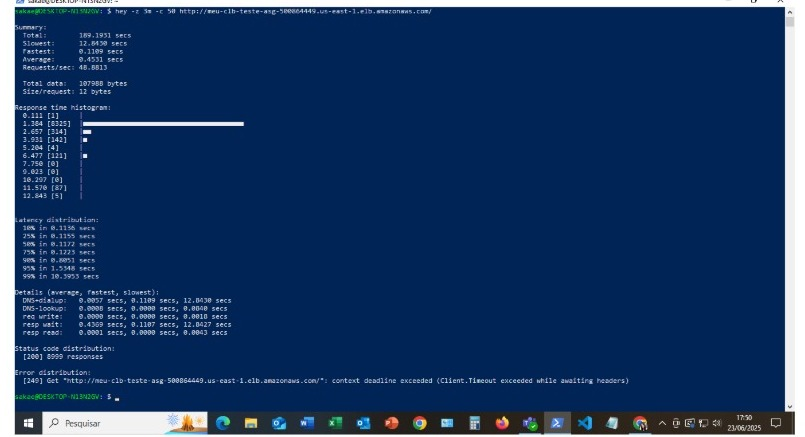

O alarme `alarme-aumentar-requestcount-clb` entrou no estado `ALARM` (conforme visto nos detalhes da métrica e no estado do alarme durante o teste).

O histórico de atividades do Auto Scaling Group confirmou que uma nova instância foi lançada em resposta ao alarme de aumento de requisições:

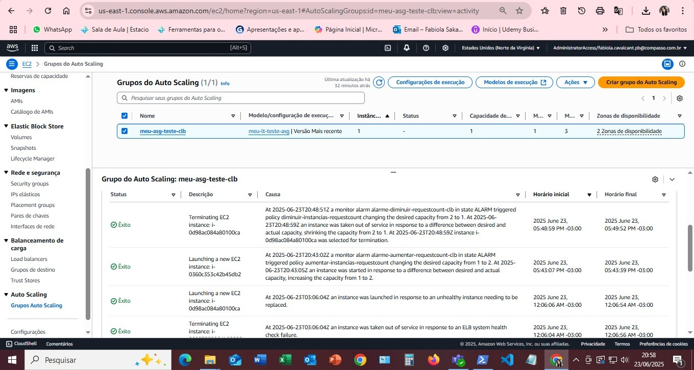
*Observar a linha "Launching a new EC2 instance ... in response to EC2 alarm ... changing the desired capacity from 1 to 2".*

A verificação no painel de instâncias EC2 confirmou a presença de duas instâncias em execução após o disparo do alarme de aumento:

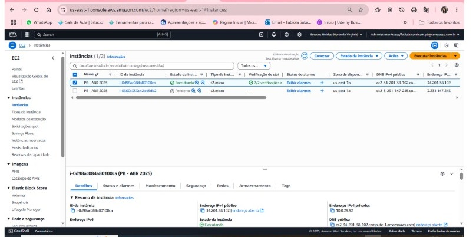
*Presença da instância original (`i-0d98ac084a80100ca`) e da nova instância (`i-0360c353c42b45db2`).*

## Conclusão

Este projeto demonstra a configuração bem-sucedida de um ambiente com Auto Scaling na AWS, que é capaz de reagir dinamicamente a alterações na demanda de tráfego. As políticas de escalabilidade baseadas em `RequestCount` do Classic Load Balancer garantem que os recursos sejam provisionados de forma eficiente, mantendo a disponibilidade da aplicação e otimizando os custos.
